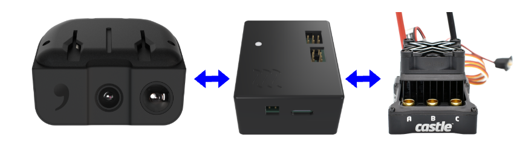

# Turbo ECU

> self-drive RC

[](https://x.com/simcity99)
[](https://vapor.autos)
[](https://github.com/vapor-autos/ecu)

## Demo

[](https://github.com/vapor-autos/ecu/raw/refs/heads/main/docs/media/turbo_ecu_clip.mp4)

## How?

[Comma 3/3X/4](https://comma.ai/) expects CAN. RC hardware speaks I2C/PWM. This bridges the gap: comma thinks it's talking to a car, ESC gets what it expects

Data path: comma <-CAN-> ECU <-PWM/I2C-> steering servo + ESC telemetry/control

No RTOS. No stdlib. 96 MHz Cortex-M4 running raw HAL



## Get Turbo ECU

Join the waitlist at [vapor.autos](https://vapor.autos), then DM @simcity99 on X with your email to get early access

## Hardware Requirements

Reference build: [Arrma Typhon](https://www.arrma-rc.com/en/product/1-8-typhon-3s-4x4-rtr-brushless-buggy-red/ARA4306V3.html) + [Castle Creations Mamba X](https://www.castlecreations.com/en/mamba-x-1) (should work with any RC + Castle ESC)


- Comma device ([Comma 3/3X/4](https://comma.ai/))
- [Turbo ECU](https://vapor.autos/)
- RC car with a [Castle Creations ESC](https://www.castlecreations.com/en/search-by-esc-family)
- [ST-LINK V2](https://www.st.com/en/development-tools/st-link-v2.html) (or compatible ST-LINK probe) for flashing Turbo ECU via SWD (`make flash`)
- [Castle Link USB](https://www.castlecreations.com/en/castle-link-v3-usb-programming-kit-011-0119-00) to flash/configure the ESC
- [USB-to-UART adapter](https://www.sparkfun.com/sparkfun-usb-to-serial-breakout-ft232rl.html) (FTDI/CP2102/CH340 or similar) only for UART debug output (`make serial` / `make dev`)


### ESC Setup

Turbo ECU includes the Castle Serial Link connection used by firmware
Before driving, you still must configure your Castle ESC with [Castle Link USB](https://www.castlecreations.com/en/castle-link-v3-usb-programming-kit-011-0119-00):

1. Connect ESC to Castle Link USB
2. Flash/update ESC firmware as needed
3. Configure ESC/Serial Link settings:
   - Enable Serial Link I2C mode
   - Set I2C slave address to `0x08`
   - Set I2C bus speed to `100kHz`
   - For reversible/car ESC setups, set fail-safe output to neutral (50 = 1.5ms)

Castle Link USB is the ESC programming adapter. Castle Serial Link is the runtime telemetry/control link
See [protocol spec](docs/castle_serial_link_protocol.md) for details


## Specs

| Interface | Protocol | Function |
|-----------|----------|----------|
| OBD-C | CAN | Steering/throttle in, speed out |
| Castle ESC | I2C | Throttle control, telemetry |
| Steering | PWM | Direct servo control |
| Headlights | GPIO | FET-switched |
| Debug | UART | printf output |

| LED Status | Meaning |
|------------|---------|
| Red | I2C connection to Castle Serial Link/ESC is bad |
| Blue | Comma CAN control traffic is active and healthy |
| Green | ECU running with I2C healthy but no recent comma CAN control traffic |

### CAN Message Contract

| CAN ID | Name | Dir (ECU view) | DLC | Payload | Units / Notes |
|--------|------|----------------|-----|---------|---------------|
| `0x202` | Steering Command | RX | 2 | `int16` (little-endian) | Raw steering command (`-18000..18000`) |
| `0x203` | Throttle Command | RX | 2 | `int16` (little-endian) | Raw throttle command (`-10000..10000`) |
| `0x204` | Headlights | RX | 1 | `u8` | `0=off`, `1=on` |
| `0x205` | Cruise Enable Command | RX | 1 | `u8` | `0=disabled`, `1=enabled` |
| `0x205` | Cruise Enable Status | TX | 1 | `u8` | Current ECU cruise state (`0/1`) |
| `0x208` | Steering Angle | TX | 2 | `int16` (little-endian) | Raw steering angle feedback |
| `0x209` | Vehicle Speed | TX | 2 | `uint16` (little-endian) | Speed in `cm/s` |

All 16-bit CAN payload fields use little-endian byte order (LSB first)

Control watchdog: if no valid control CAN traffic is received for `500ms`, throttle and steering decay to neutral

### Loop Rates

| Loop | Rate | Function |
|------|------|----------|
| Main scheduler tick | 1kHz | Runs time-sliced task checks and CAN RX processing |
| CAN telemetry TX | 100Hz | Sends round-robin status frames (`0x205`, `0x209`, `0x208`) |
| Actuator update | 50Hz | Writes steering PWM + Castle throttle command |
| Speed read | 20Hz | Reads Castle speed register and updates CAN speed payload |
| Debug print | 1Hz | UART runtime counters/state snapshot |


## Dev

### First time setup

```bash
make install-deps  # Install system deps: clang-format, clang-tidy, ARM toolchain, openocd
make setup         # Create venv and install Python deps
make keys          # Generate signing keypair
```

### Build and flash

Activate the venv before running make commands:

```bash
source venv/bin/activate
make               # Build firmware
make flash         # Build and flash to device
make dev           # Flash and open serial monitor
make serial        # Open UART debug console
```

### Other commands

```bash
make lint          # Run linters (ruff + clang-format)
make tidy-ci       # Run clang-tidy in CI mode (fails on errors)
make fmt           # Auto-format C code
make help          # Show all commands
```

## Development

### Release build

```bash
RELEASE=1 CERT=/path/to/cert make   # Production build with custom certificate
```

### Project structure

```
board/          Firmware source code
  main.c        Main application loop
  bootstub.c    Bootstub (signature verification TODO)
  can.h         CAN message handling
  castle.h      I2C comms with Castle Serial Link
  inc/          STM32 HAL drivers and CMSIS headers
  obj/          Build artifacts (ELF/BIN and object files)
crypto/         RSA signature verification
docs/           Documentation
  turbo_ecu_pinout.md             Turbo ECU board-level pin assignments
  stm32f413_af_table.md           STM32F413 alternate-function reference
  castle_serial_link_protocol.md  Castle ESC I2C protocol spec
tests/          Hardware test utilities
```

## References

- [Turbo ECU Pinout](docs/turbo_ecu_pinout.md)
- [STM32F413 AF Table](docs/stm32f413_af_table.md)
- [STM32F413CG Datasheet](https://www.st.com/resource/en/datasheet/stm32f413cg.pdf)
- [STM32 HAL Documentation](https://www.st.com/resource/en/user_manual/um1725-description-of-stm32f4-hal-and-lowlayer-drivers-stmicroelectronics.pdf)
- [Castle Serial Link Protocol](docs/castle_serial_link_protocol.md)

## License

This project is licensed under the MIT License. See [LICENSE](LICENSE).

## TODO

- Enforce boot-time signature verification in `bootstub.c` before jumping to app
- Add anti-rollback version checks in bootstub
- Split debug/release key material (separate keypairs and trust policy)
- Verify Castle electrical-RPM to vehicle-speed conversion against measured ground truth
- Calibrate steering angle offset and update `STEERING_ANGLE_OFFSET` accordingly


> Full KiCad hardware files are coming soon


## Acknowledgments

Codebase is heavily inspired by [comma body](https://github.com/commaai/body)
